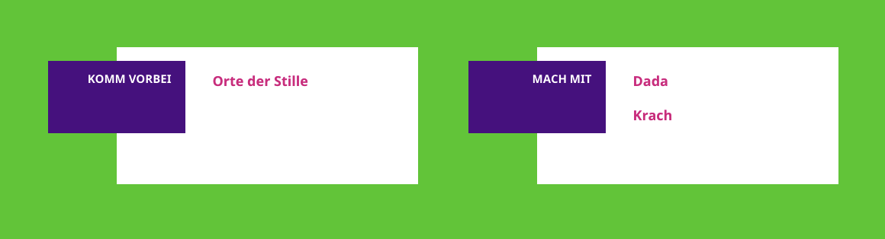
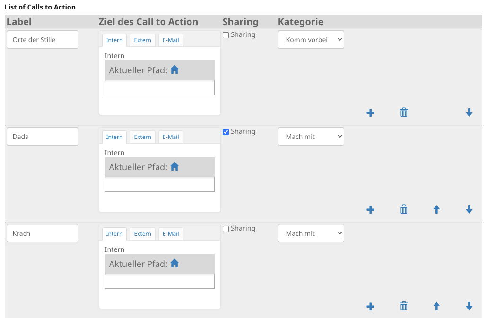

================================
collective.multiplecalltoactions
================================

Show 'call to action's on pages.
Each page can have multiple inidvidual 'call to action's.

Installation
------------

Install collective.multiplecalltoactions by adding it to your buildout::

    [buildout]

    ...

    eggs =
        collective.multiplecalltoactions

and then running ``bin/buildout``

Usage
-----

Categories can be customized via registry entry ctocategories

Contribute
----------

- Issue Tracker: https://github.com/collective/collective.multiplecalltoactions/issues
- Source Code: https://github.com/collective/collective.multiplecalltoactions

Support
-------

If you are having issues, please let us know.
Issue Tracker: https://github.com/collective/collective.multiplecalltoactions/issues

License
-------

If you are making money, came back to Plone Foundation <TODO> and spend your part.

Additional Information
----------------------

Uses collective.z3cform.datagridfield
